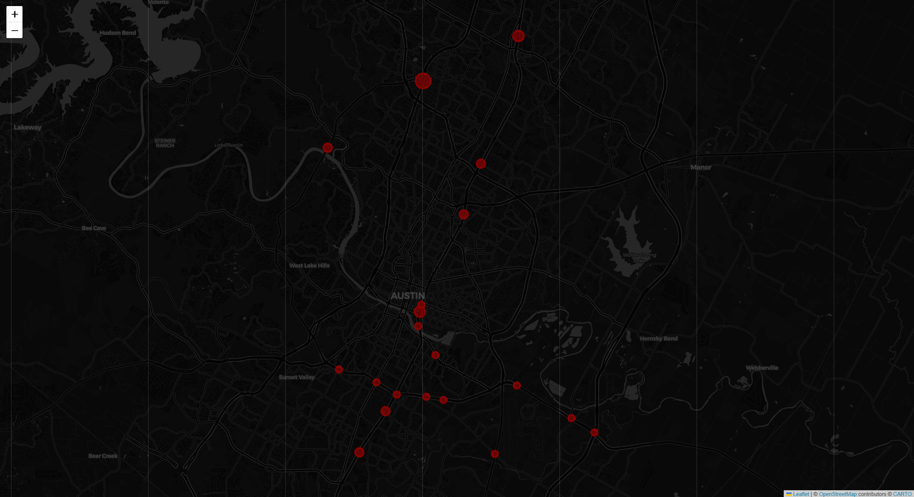
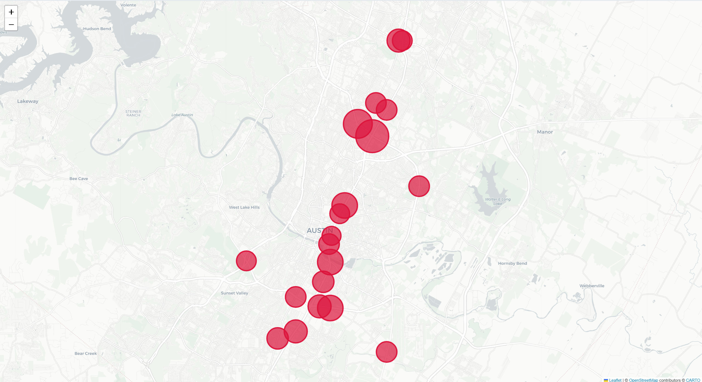
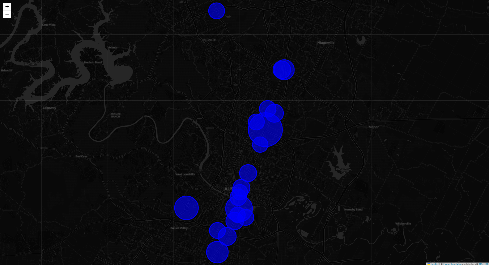

# 🚦 Dangerous Intersection Detector: Pro Version (Lat/Lon + Street Name)

This project identifies and predicts **high-risk intersections** in Austin, Texas, using real-world crash data and machine learning techniques.

🔹 Built for **RiverHacks 2025 Hackathon**  
🔹 Pro Version supports **both** Latitude/Longitude **and** Street Name lookup!  
🔹 Developed with using Python, Pandas, Scikit-Learn, Flask, and Folium.

---

## 📊 Project Features

- **Crash Data Cleaning:** Handle missing values, fix timestamps, engineer a custom `danger_score`.
- **Grid-Based Grouping:** Round coordinates to ~100m cells to aggregate crashes spatially.
- **Crash Hotspot Mapping:** Interactive Folium maps show high-risk areas and fatal hotspots.
- **Night-Time Risk Analysis:** Identify intersections dangerous after dark (8 PM – 6 AM).
- **Machine Learning:**
  - Clustering dangerous zones using DBSCAN
  - Binary crash risk prediction with Random Forest Classifier + SMOTE balancing
  - Time-aware danger prediction model (including Hour and Day of Week)
- **Street Name Lookup:** Users can query danger prediction using Street Names, without knowing Lat/Lon!
- **Flask App:** Real-time intersection risk lookup by location or streets.
- **Batch CSV Upload:** Upload multiple locations and get risk predictions at once.

---

## 🚀 How It Works

1. **Load and clean Austin crash data** (latitude, longitude, street names, injuries, deaths).
2. **Create danger scores** based on fatality and injury severity.
3. **Group crashes into 100m grid cells**.
4. **Train ML models** to predict danger levels based on crash patterns and timing.
5. **Deploy a simple Flask app** that:
   - Accepts either Lat/Lon or Primary + Secondary Streets.
   - Returns crash risk prediction and confidence.
   - Supports CSV file uploads for batch scoring.

---

## 🛠️ Technologies Used

| Tool          | Purpose                          |
|---------------|-----------------------------------|
| Python        | Main language                     |
| Pandas        | Data cleaning and feature engineering |
| Folium        | Mapping dangerous zones           |
| Scikit-Learn  | Clustering (DBSCAN), Classification (Random Forest) |
| Flask         | Web application                   |
| SMOTE         | Balancing classes for better model accuracy |
| HTML / CSS    | Front-end form styling             |

---

## 📂 Project Structure

```bash
/
├── crash_analysis_street.ipynb     # Full Jupyter notebook (Pro version)
├── app/
│   ├── app.py                      # Flask app code
│   ├── templates/
│   │   ├── index.html              # Home page for single prediction
│   │   ├── upload.html             # Batch upload form
│	├── danger_grid_model_time.pkl  # Final ML model (with hour/day features)
├── data/
│   ├── crash_data_cleaned.csv # Cleaned Austin crash dataset (Not uploaded due to size)
│   ├── intersection_lookup.csv # Processed street intersection lookup
│   ├── grid_summary_time.csv  # Aggregated grid data with time features
│
├── images/
│	├── fatal_crashes.png      # Fatal crash hotspots visualization
│   ├── most_dangerous.png     # General crash density hotspots visualization
│   ├── night_crashes.png      # Nighttime crash hotspots visualization
│  
├── maps/
│   ├── map_fatal_crashes.html 
│   ├── map_most_dangerous.html
│   ├── map_night_crashes.html
│
├── screenshots/
│   ├── 1_landing_page.png # For http://127.0.0.1:5000
│   ├── 2_single_prediction.png # Result from http://127.0.0.1:5000
│   ├── 3_batch_upload_form.png # For http://127.0.0.1:5000/Upload
│   ├── 4_batch_upload_results.png # Result from http://127.0.0.1:5000/Upload
│
├── test/
│   ├── test_upload_latlon.csv # A sample test file to upload with Latitude/Longitude
│   ├── test_upload_mix.csv # A sample test file to upload with Latitude/Longitude and Primary Street/Secondary Street
│   ├── test_upload_street.csv # A sample test file to upload with Primary Street/Secondary Street
│
│
├── README.md                       # (This file)
├── LICENSE                    # MIT License
```

## 🌟 Key Highlights

- **Austin crash dataset** sourced directly from [City of Austin Open Data Portal](https://data.austintexas.gov).
- **Flexible input**: Either latitude/longitude or street name intersections!
- **Balanced ML models** using **SMOTE** for better rare event prediction.
- **Realistic app scenario**: Flagging high-risk areas for city safety officials.

---

## 🗺️ Visualization Samples

Here are some hotspot visualizations generated during the crash analysis:

### Fatal Crash Hotspots

*Concentrated areas with the highest number of fatal crashes across Austin.*

---

### Most Dangerous Crash Zones

*Overall crash density indicating high-incident intersections and road segments.*

---

### Night-Time Crash Hotspots

*Dangerous areas specifically for crashes occurring between 8 PM and 6 AM.*


---

## 📋 How To Run Locally

1. **Clone this repository**:
   ```bash
   git clone https://github.com/your-username/dangerous-intersections-pro.git
   cd dangerous-intersections-pro
	```

2. **Install dependencies**:
	```bash
pip install flask pandas scikit-learn folium imbalanced-learn
	```
3. **Run the app**:
	```bash
	cd app
	python app.py
	```
4. **Open your browser and navigate to**:

http://127.0.0.1:5000

For single output: latitude/longitude OR Primary Street/Secondary Street

http://127.0.0.1:5000/upload

For batch upload, a CSV file

## Dataset Files
Due to GitHub size restrictions, large files like `crash_data_cleaned.csv` and map HTML files are **not included** in this repository.  
They are available upon request or can be regenerated by running the Jupyter notebooks provided.

## How to Reproduce
- Download raw crash data from [Austin Open Data Portal](https://data.austintexas.gov/)
- Follow the notebook to clean, process, and generate models.

---

## 👩‍💻 Developer

Built with by [Nasim Bayati](https://github.com/nasimbayati)

## 📜 License

This project is licensed under the [MIT License](LICENSE).
